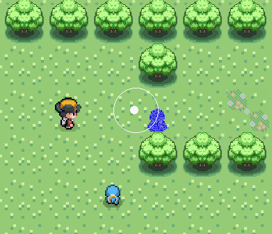
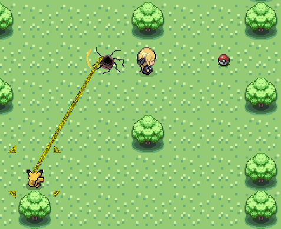
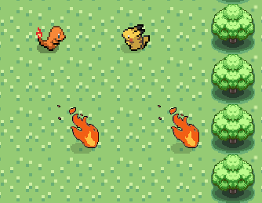

# so_long


A small 2D game project from 42 school.

The goal is to create a simple game using the MiniLibX, where the player moves on a map, collects items, dodge enemies and reaches the exit.


---

<p align="center">
  
  
  
</p>

---

## Compilation

Available Makefile rules:

* `make`
  Compile the **mandatory** basic version

* `make bonus`
  Compile the **bonus version** → `so_long_bonus`

* `make a`
  ✅ **Recommended**:
  Compile and run the bonus version with a valid map

* `make v`
  Run the game with **Valgrind** on a small valid map

* `make m`
  Run **extensive tests with invalid maps** using Valgrind
  → checks error handling, leaks, edge cases

---

## 🎮 Controls

* `W A S D` or `↑ ↓ ← →` → Move
* `SPACE` → Throw Pokeball
* `CTRL-left` *(while not moving)* → Toggle run
* `E` → Print memory state

---

## 🧪 Testing

A **tester Makefile block** is provided.

### How to use it:

1. Copy the tester block into your own Makefile
2. Copy the `map/` folder at the root of your project
3. Set a valid sprite name for the $IMG_SPRITE inside the Makefile
4. Make sure:

   * Project name = `so_long`
   * Bonus binary = `so_long_bonus` *(or update variable)*

### Run tests:

```bash
make m
```

This will:

* Test multiple **invalid maps**
* Check:

  * map format errors
  * missing elements
  * invalid characters
  * enclosure issues
* Run everything through **Valgrind**
* Pause between tests for inspection

---
